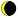
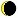
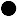
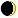
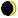
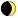

# Moon Phases in the Forgotten Realms Calendar

This document explains how moon phases work in the Forgotten Realms calendar system, specifically for the moon Selûne.

## Moon Phase Numbers and Their Meanings

Each moon phase is represented by a number (0-16) in the phase arrays. Here's what each number represents:

### New Moon (Phase 0)

- Completely dark moon
- Array value: 0
- Used in arrays when the moon is completely dark

### Waxing Crescent (Phases 1-2)

 

- Moon is growing from new to first quarter
- Array values: 1-2
- Shows a small illuminated crescent on the right side

### First Quarter (Phases 3-4)

 

- Half of the moon is illuminated on the right side
- Array values: 3-4
- Represents the quarter phase as the moon waxes towards full

### Waxing Gibbous (Phases 5-6)

 

- More than half illuminated, growing towards full
- Array values: 5-6
- Shows most of the moon illuminated on the right side

### Full Moon (Phases 7-8)

 

- Completely illuminated moon
- Array values: 7-8
- Used in arrays when the moon is completely bright

### Waning Gibbous (Phases 9-10)

 

- More than half illuminated, shrinking from full
- Array values: 9-10
- Shows most of the moon illuminated on the left side

### Last Quarter (Phases 11-12)

 

- Half of the moon is illuminated on the left side
- Array values: 11-12
- Represents the quarter phase as the moon wanes towards new

### Waning Crescent (Phases 13-16)

   

- Moon is shrinking from last quarter to new
- Array values: 13-16
- Shows a small illuminated crescent on the left side

## Understanding the Moon Phase Arrays

The moon phase arrays in `calendarUtils.ts` store the phase data for each day of each month. Here's how to read them:

1. Each month takes up 32 slots in the array
2. The index is calculated as: `(month-1)*32 + day`
3. The value at that index (0-16) represents the moon phase for that day

### Example for Year 1368 DR (Type 1 Leap Year)

For Hammer (Month 1):

- Day 1: Index 1, Value 8 (Full Moon)
- Day 8: Index 8, Value 15 (Waning Crescent)
- Day 16: Index 16, Value 0 (New Moon)
- Day 24: Index 24, Value 7 (Full Moon)

This pattern repeats for each month, with the phases progressing:
Full → Waning Gibbous → Last Quarter → Waning Crescent → New → Waxing Crescent → First Quarter → Waxing Gibbous → Full

## Converting Phase Numbers to User-Friendly Indices

For display purposes, we convert the 0-16 phase numbers to 0-7 indices:

| Phase Numbers | User Index | Moon Phase      |
| ------------- | ---------- | --------------- |
| 0             | 0          | New Moon        |
| 1-2           | 1          | Waxing Crescent |
| 3-4           | 2          | First Quarter   |
| 5-6           | 3          | Waxing Gibbous  |
| 7-8           | 4          | Full Moon       |
| 9-10          | 5          | Waning Gibbous  |
| 11-12         | 6          | Last Quarter    |
| 13-16         | 7          | Waning Crescent |

This conversion is handled by the `convertMoonPhaseToIndex` function in `calendarUtils.ts`.
